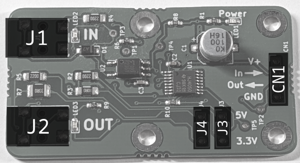

# MIDI-UART interface-san Kit

MIDI UART interface-san is a handy interface PCB for MIDI and microcontrollers with commonly used basic circuit when you start developping  MIDI-related  MCU project, e.g. TRS jacks for MIDI I/O, optocouplers, digital buffers, etc. It means by using this PCB, you do not have to repeat soldering/making a breadboard for these purpose anymore.

You can choose both 5V and 3.3V for power supply(can be selected jumper pins), to match the voltage your of MCU.

## Kit contents

- Pre-assembled circuit board
- 3.5mm TRS Jack connectors (J1, J2)
- 1x3P Pin Headers(J3, J4)
- 1x4P Pin Socket(CN1)
- Jumper pins(yellow) 2pcs.
- MIDI DIN <-> TRS(3.5mm) conversion cable(A type) 2pcs.

## How to assemble

Solder all of the jacks and connectors on the circuit board.
Please refer to the following image.

## How to use

- Select operation voltage by shorting Jumper pins on J3, J4. By shorting above two pins for 5V, bottom two pins for 3.3V.
- Connect V+ and GND to the circuit board, breadboard, or something you want to use with this product.
- Connect `In->` to the MCU's MIDI Input.
- Connect `Out->` to the MCU's MIDI Output.

## Schematics, design data, etc

<https://github.com/kinoshita-lab/MIDI-UART-interface-san>
